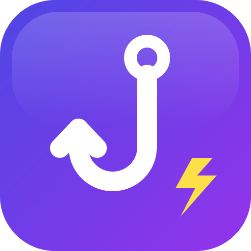
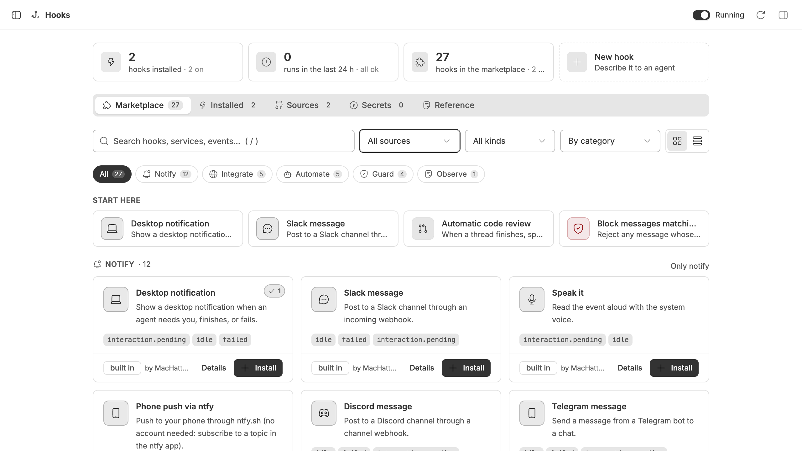
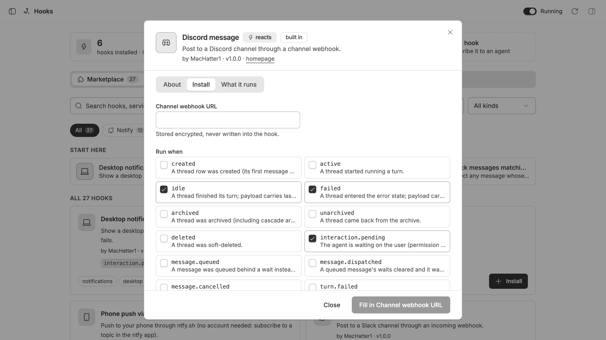

<p align="center">
  
</p>

<h1 align="center">BB Hooks Marketplace</h1>

<p align="center">
  Ready-made hooks for <a href="https://github.com/get-bb/bb">BB</a> agents: notifications, integrations, automation, and gate policies.<br>
  Browse them on BB's <strong>Hooks</strong> page and install with one click, or with one command.
</p>

<p align="center">
<!-- stats:start -->
    
<!-- stats:end -->
</p>

## Add this catalog

```sh
bb hooks marketplace add MacHatter1/bb-hooks-marketplace
bb hooks templates --search pager
bb hooks use community/pagerduty --set routingKey=… --yes
```

Or in BB: **Hooks → Sources → Add** `MacHatter1/bb-hooks-marketplace`, then
install from the **Marketplace** tab. Pin a release with
`MacHatter1/bb-hooks-marketplace@v1.1.0`.

## Browse templates

<!-- catalog:start -->
[🔔 Notify (11)](#-notify) · [🔌 Integrate (3)](#-integrate) · [🤖 Automate (5)](#-automate) · [🛡️ Guard (4)](#-guard) · [📄 Observe (1)](#-observe)

### 🔔 Notify

| Hook | Security | Performance |
| :-- | :-: | :-: |
| **Pushover notification**<br>Push to your phone through Pushover.<br><sub>**Runs when** an agent needs you or a thread fails</sub><br><sub>**Setup** 🔒 Application token, 🔒 User key</sub><br><sub>`community/pushover` v1.0.0 · by [@MacHatter1](https://github.com/MacHatter1) · </sub> | 🟢 A+<br><sub>100</sub> | 🟢 A+<br><sub>100</sub> |
| **PagerDuty alert**<br>Trigger a PagerDuty incident when a thread or turn fails.<br><sub>**Runs when** a thread fails or a turn fails</sub><br><sub>**Setup** 🔒 Integration routing key</sub><br><sub>`community/pagerduty` v1.0.0 · by [@MacHatter1](https://github.com/MacHatter1) · </sub> | 🟢 A+<br><sub>100</sub> | 🟢 A+<br><sub>100</sub> |
| **Microsoft Teams message**<br>Post to a Teams channel through an incoming webhook or workflow URL.<br><sub>**Runs when** a turn finishes, a thread fails or an agent needs you</sub><br><sub>**Setup** 🔒 Incoming webhook URL</sub><br><sub>`community/teams` v1.0.0 · by [@MacHatter1](https://github.com/MacHatter1) · </sub> | 🟢 A+<br><sub>100</sub> | 🟢 A+<br><sub>100</sub> |
| **Mattermost message**<br>Post to a Mattermost channel through an incoming webhook.<br><sub>**Runs when** a turn finishes, a thread fails or an agent needs you</sub><br><sub>**Setup** 🔒 Incoming webhook URL</sub><br><sub>`community/mattermost` v1.0.0 · by [@MacHatter1](https://github.com/MacHatter1) · </sub> | 🟢 A+<br><sub>100</sub> | 🟢 A+<br><sub>100</sub> |
| **Email via Resend**<br>Email yourself the result or error of a thread through the Resend API.<br><sub>**Runs when** a turn finishes or a thread fails</sub><br><sub>**Setup** 🔒 Resend API key, From address, To address</sub><br><sub>`community/resend-email` v1.0.0 · by [@MacHatter1](https://github.com/MacHatter1) · </sub> | 🟢 A+<br><sub>100</sub> | 🟢 A+<br><sub>100</sub> |
| **Desktop notification**<br>Show a desktop notification when an agent needs you, finishes, or fails.<br><sub>**Runs when** an agent needs you, a turn finishes or a thread fails</sub><br><sub>**Requires** osascript (macOS) or notify-send (Linux) on the BB server</sub><br><sub>`community/desktop-notify` v1.0.0 · by [@MacHatter1](https://github.com/MacHatter1) · </sub> | 🟢 A+<br><sub>100</sub> | 🟢 A+<br><sub>100</sub> |
| **Speak it**<br>Read the event aloud with the system voice.<br><sub>**Runs when** an agent needs you or a turn finishes</sub><br><sub>**Requires** say (macOS) or spd-say or espeak (Linux) on the BB server</sub><br><sub>`community/speak` v1.0.0 · by [@MacHatter1](https://github.com/MacHatter1) · </sub> | 🟢 A+<br><sub>100</sub> | 🟢 A+<br><sub>100</sub> |
| **Phone push via ntfy**<br>Push to your phone through ntfy.sh (no account needed: subscribe to a topic in the ntfy app).<br><sub>**Runs when** an agent needs you or a thread fails</sub><br><sub>**Setup** 🔒 ntfy topic</sub><br><sub>`community/ntfy` v1.0.0 · by [@MacHatter1](https://github.com/MacHatter1) · </sub> | 🟢 A+<br><sub>100</sub> | 🟢 A+<br><sub>100</sub> |
| **Slack message**<br>Post to a Slack channel through an incoming webhook.<br><sub>**Runs when** a turn finishes, a thread fails or an agent needs you</sub><br><sub>**Setup** 🔒 Incoming webhook URL</sub><br><sub>`community/slack` v1.0.0 · by [@MacHatter1](https://github.com/MacHatter1) · </sub> | 🟢 A+<br><sub>100</sub> | 🟢 A+<br><sub>100</sub> |
| **Discord message**<br>Post to a Discord channel through a channel webhook.<br><sub>**Runs when** a turn finishes, a thread fails or an agent needs you</sub><br><sub>**Setup** 🔒 Channel webhook URL</sub><br><sub>`community/discord` v1.0.0 · by [@MacHatter1](https://github.com/MacHatter1) · </sub> | 🟢 A+<br><sub>100</sub> | 🟢 A+<br><sub>100</sub> |
| **Telegram message**<br>Send a message from a Telegram bot to a chat.<br><sub>**Runs when** a turn finishes, a thread fails or an agent needs you</sub><br><sub>**Setup** 🔒 Bot token, Chat id</sub><br><sub>`community/telegram` v1.0.0 · by [@MacHatter1](https://github.com/MacHatter1) · </sub> | 🟢 A+<br><sub>100</sub> | 🟢 A+<br><sub>100</sub> |

### 🔌 Integrate

| Hook | Security | Performance |
| :-- | :-: | :-: |
| **Home Assistant webhook**<br>Trigger a Home Assistant automation, for example turn a lamp red when an agent needs you.<br><sub>**Runs when** an agent needs you or a turn finishes</sub><br><sub>**Setup** 🔒 Webhook URL</sub><br><sub>`community/home-assistant` v1.0.0 · by [@MacHatter1](https://github.com/MacHatter1) · </sub> | 🟢 A+<br><sub>100</sub> | 🟢 A+<br><sub>100</sub> |
| **Comment on the linked GitHub issue**<br>When a thread whose title mentions #123 finishes, post its output as a comment on issue 123.<br><sub>**Runs when** a turn finishes</sub><br><sub>**Setup** Repository (owner/name)</sub><br><sub>**Requires** the gh CLI authenticated on the BB server</sub><br><sub>`community/github-issue-comment` v1.0.0 · by [@MacHatter1](https://github.com/MacHatter1) · </sub> | 🟢 A-<br><sub>90</sub> | 🟢 A-<br><sub>90</sub> |
| **Generic webhook**<br>POST the raw event JSON to any URL (signed when the webhook secret is set).<br><sub>**Runs when** a turn finishes</sub><br><sub>**Setup** Endpoint URL</sub><br><sub>`community/webhook` v1.0.0 · by [@MacHatter1](https://github.com/MacHatter1) · </sub> | 🟠 C<br><sub>75</sub> | 🟢 A+<br><sub>100</sub> |

### 🤖 Automate

| Hook | Security | Performance |
| :-- | :-: | :-: |
| **Archive finished threads**<br>Archive a thread as soon as it goes idle. Scope it with a title filter so only throwaway threads are archived.<br><sub>**Runs when** a turn finishes</sub><br><sub>`community/archive-when-done` v1.0.0 · by [@MacHatter1](https://github.com/MacHatter1) · </sub> | 🟠 C<br><sub>75</sub> | 🟢 A+<br><sub>100</sub> |
| **Provider failover on rate limits**<br>When a turn fails because the provider is rate limited, re-run the same prompt on another provider.<br><sub>**Runs when** a turn fails</sub><br><sub>**Requires** jq and the bb CLI on the BB server</sub><br><sub>`community/failover` v1.1.0 · by [@MacHatter1](https://github.com/MacHatter1) · </sub> | 🟢 A+<br><sub>100</sub> | 🟢 A-<br><sub>90</sub> |
| **Continue after capacity errors**<br>Send a continue prompt when a turn fails with a model-capacity error.<br><sub>**Runs when** a turn fails</sub><br><sub>**Requires** jq and the bb CLI on the BB server</sub><br><sub>`community/continue-on-capacity` v1.0.0 · by [@MacHatter1](https://github.com/MacHatter1) · </sub> | 🟢 A+<br><sub>100</sub> | 🔴 D<br><sub>65</sub> |
| **Spawn a follow-up thread**<br>When a thread finishes, start a new thread in the same workspace with your prompt plus the finished thread's output.<br><sub>**Runs when** a turn finishes</sub><br><sub>**Setup** Prompt for the follow-up</sub><br><sub>`community/follow-up` v1.0.0 · by [@MacHatter1](https://github.com/MacHatter1) · </sub> | 🟢 A+<br><sub>100</sub> | 🔴 F<br><sub>15</sub> |
| **Automatic code review**<br>When a thread finishes, spawn a reviewer thread that inspects its work and answers APPROVE or REQUEST CHANGES.<br><sub>**Runs when** a turn finishes</sub><br><sub>`community/review` v1.0.0 · by [@MacHatter1](https://github.com/MacHatter1) · </sub> | 🟢 A+<br><sub>100</sub> | 🔴 F<br><sub>15</sub> |

### 🛡️ Guard

| Hook | Security | Performance |
| :-- | :-: | :-: |
| **Block messages that contain credentials**<br>Reject any message that looks like it contains an API key, token, or private key.<br><sub>**Runs when** a message is about to be sent</sub><br><sub>`community/block-secrets` v1.0.0 · by [@MacHatter1](https://github.com/MacHatter1) · </sub> | 🟠 C<br><sub>75</sub> | 🟢 A+<br><sub>100</sub> |
| **Require a ticket reference**<br>Reject a thread's first message unless it references a ticket like ENG-123.<br><sub>**Runs when** a message is about to be sent</sub><br><sub>`community/require-ticket` v1.0.0 · by [@MacHatter1](https://github.com/MacHatter1) · </sub> | 🟢 A+<br><sub>97</sub> | 🟢 A+<br><sub>100</sub> |
| **Block messages matching a pattern**<br>Reject any message whose text matches a regular expression, showing your reason.<br><sub>**Runs when** a message is about to be sent</sub><br><sub>**Setup** Regular expression</sub><br><sub>`community/block-pattern` v1.0.0 · by [@MacHatter1](https://github.com/MacHatter1) · </sub> | 🟠 C<br><sub>75</sub> | 🟢 A+<br><sub>100</sub> |
| **Office hours**<br>Hold messages sent outside a daily window until it opens (server local time).<br><sub>**Runs when** a message is about to be sent</sub><br><sub>`community/office-hours` v1.0.0 · by [@MacHatter1](https://github.com/MacHatter1) · </sub> | 🟢 A+<br><sub>100</sub> | 🟢 A+<br><sub>100</sub> |

### 📄 Observe

| Hook | Security | Performance |
| :-- | :-: | :-: |
| **Log to file**<br>Append every event as one JSON line to a file on the server.<br><sub>**Runs when** a thread is created, a turn finishes, a thread fails or a thread is archived</sub><br><sub>**Setup** File path (on the BB server)</sub><br><sub>`community/log-to-file` v1.0.0 · by [@MacHatter1](https://github.com/MacHatter1) · </sub> | 🟢 A+<br><sub>100</sub> | 🟢 A+<br><sub>97</sub> |
<!-- catalog:end -->

**Setup** lists what you enter when installing; 🔒 marks a value BB stores
encrypted and never writes into the hook. **Requires** lists software the
machine running your BB server needs.

**Security** and **Performance** are maintainer review scores out of 100.
Security asks whether a template can hurt you or leak your data. Performance
asks what it costs to keep installed: loops, agent spawns, delays to your
messages. Grades follow the usual scale: A+ is 97 and up, A is 93, A- is 90,
B+ is 87, and so on down to D- at 60; anything below 60 is F. The dot shows
the band at a glance: 🟢 A, 🟡 B, 🟠 C, 🔴 D or F. The deductions behind each
score are in [scores.json](scores.json). A `*` means the template changed
after it was scored.

## Preview in BB

The Hooks page lists this catalog next to built-in templates. Each card shows
its author and events; opening a template shows what it runs before
installation.





## Safety and permissions

Hooks run on the machine hosting your BB server. Command templates execute
shell scripts there; URL templates send requests to the configured endpoint.
Review the **What it runs** details and only install templates you trust. BB
asks you to confirm before installing, and secret settings are stored
encrypted.

Gate templates can reject or hold a message before it reaches the agent. Check their matching rules and decision behavior before enabling them.

Install counts for this catalog are opt-in, and they only work through our
Hooks plugin for BB. The plugin does the asking and the reporting; this
catalog is just a JSON file and sends nothing, and older plugin versions and
other tools never report. With a plugin version that has install counts, BB
asks once before sharing anything. If you agree, each new install from this
catalog sends the template id and version to [our counter](stats), and
nothing else: no settings, secrets or thread data, and nothing about other
catalogs. Like any web request, it arrives from your network address; the
counter keeps only a salted hash of it for a day, to stop repeat counts, and
never stores the address. Change your answer with
`bb hooks marketplace stats on|off`, or in the Hooks settings.

## Catalog format

The catalog is a single `hooks-catalog.json` document served over HTTPS. BB
caches catalogs and refreshes them every six hours. Add this repository as
`owner/repo`, pin a release with `owner/repo@ref`, or provide a URL to the
catalog file.

The [catalog schema](schema/hooks-catalog.schema.json) validates the document.
See the [catalog format reference](docs/catalog-format.md) for template fields
and placeholders.

## Contribute

Add a template to `hooks-catalog.json`, run `npm run validate` and
`npm run readme`, and open a pull request. The [contributing guide](CONTRIBUTING.md)
has the full recipe, including how to test against a running BB, and the
[security policy](SECURITY.md) says what will and will not be merged. Not sure
yet? [Propose a template](../../issues/new?template=propose-template.yml) as an
issue first.

## Run your own marketplace

Fork this repository, or start from
`bb hooks marketplace init > hooks-catalog.json`, push it to GitHub, and share
`owner/repo`. `bb hooks marketplace validate owner/repo` checks a published
catalog from any BB.

## License

MIT. The logo and social preview in `assets/` are yours to reuse for your own
catalog.
